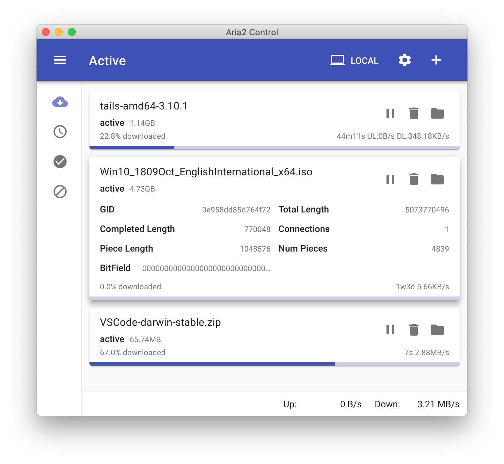

# electron-aria2

A simple download utility that aims to deliver the performance and features of Aria2, with an easy to use interface with minimal setup required.

## Screenshot

Full sized window, using built-in Aria2, with 2 HTTP tasks and 1 BitTorrent task, running on macOS 10.14:

## Download

Check the [releases page](https://github.com/jack9966qk/electron-aria2/releases) for source code and builds. 